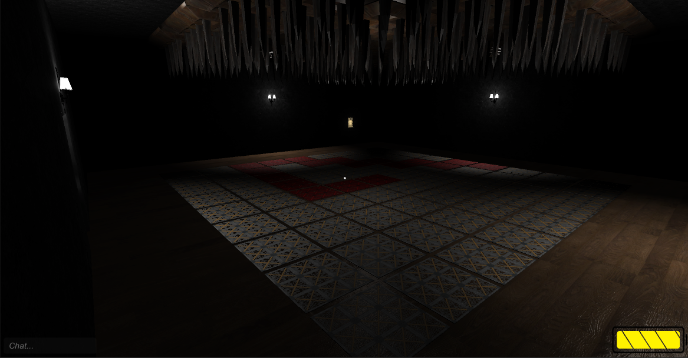
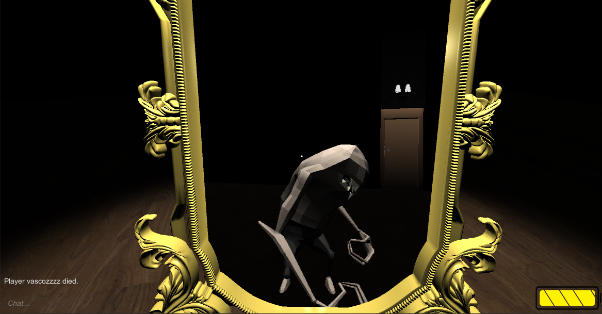
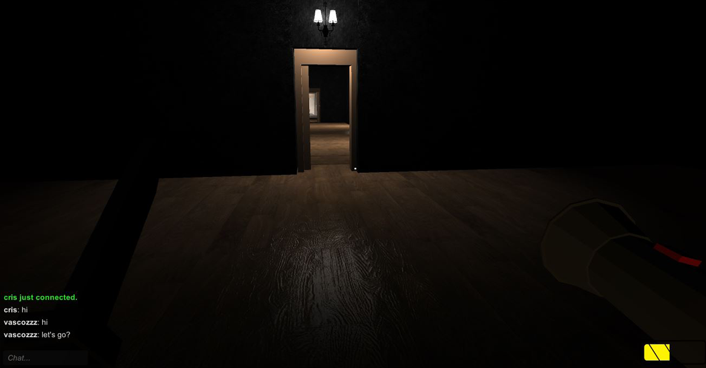

# Writhe

Writhe is a 3D survival-horror multiplayer game. Designed for up to 4 players, it aims to offer an unique online experience for both horror fans and beginners looking for the next multiplayer challenge. In Writhe, a group of four people wake up inside an unknown room. They must work together in order to escape from a series of challenges in what appears to be an endless maze. The players themselves get to decide who to work with, or against, as they attempt to carve a path to the end.

A group of four people wake up inside an unknown room. But how many leave?

## Team Members
- Cristiano Carvalheiro - ei10041@fe.up.pt
- Hugo Cardoso - ei11154@fe.up.pt
- Noelia Giner - up201401780@fe.up.pt
- Vasco Gomes - ei11161@fe.up.pt

## Features

- Online multiplayer
- Two unique game modes
- Randomly generated maps
- Up to 10 unique room challenges
- Chat system

## Technological Overview

Writhe was fully developed with the Unity 5 engine. For networking logic, it relies on Photon PUN to provide a high level of abstraction on the implementation of server-client communication and ease the hosting of game sessions. 

## Screenshots

